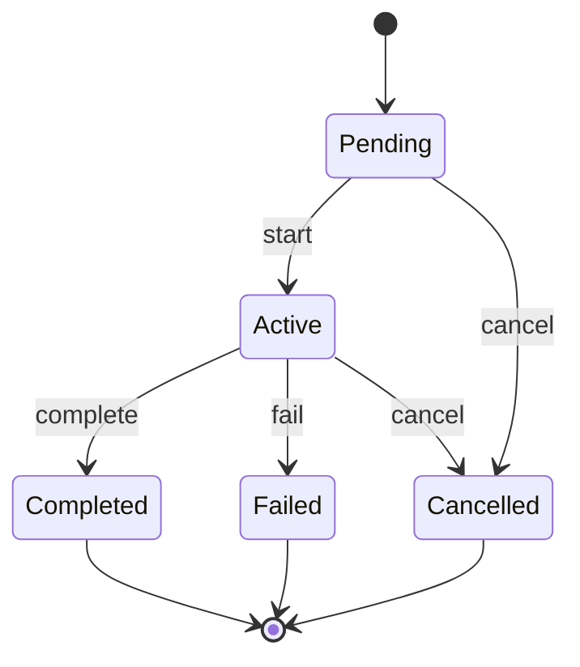
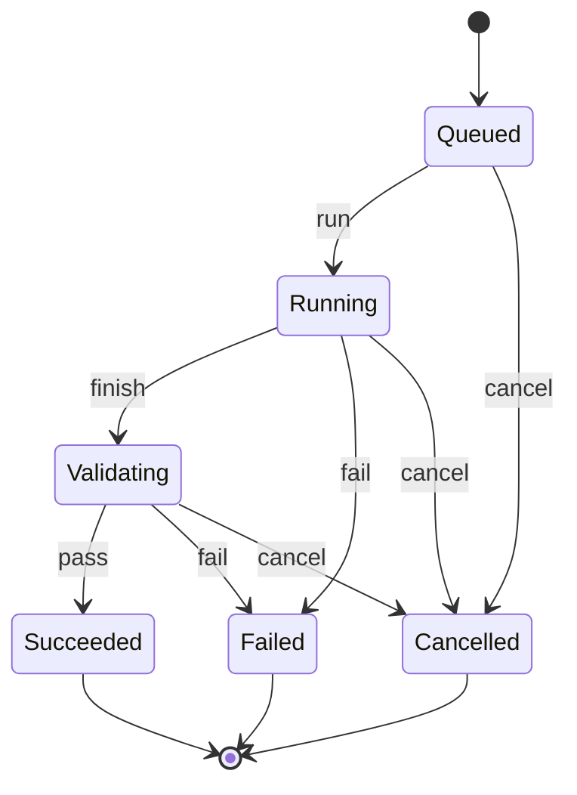

# 作業と実行のドメインモデル

この文書は、AI Dev Orchestrator が管理する「作業」と、その作業を進めるための「実行記録」の最小構造を定義する。
Provider、MCP、実行環境の具体的なインターフェースは定義しない。実行履歴を保存する場所の詳細も別途定義する。

| この文書での言葉 | 実装上の名前 | 意味 |
| --- | --- | --- |
| 作業 | `Task` | 利用者から依頼され、完了まで追跡する1件の開発依頼 |
| 実行 | `Attempt` | 作業を進めるために行う、開始から結果確定までの1回分の処理 |

同じ作業で実装、レビュー、修正を順番に扱うときの履歴と完了判断は、
[実装・レビュー・修正を記録する設計](implementation-review-model.md)で定義する。現在のRust実装は
この文書の最初の版であり、拡張設計の型と保存形式は後続Issueで実装する。

## 設計方針

- 作業（`Task`）は「何を達成するか」を表す。特定の実行先による1回の処理は表さない。
- 実行（`Attempt`）は、ある作業をある実行先で1回処理した記録である。失敗後の再試行や切り替え再試行は、新しい実行として記録する。
- 1件の作業には0件以上の実行が属し、各実行は必ず1件の作業に属する。
- 担当の期待（`TaskRole`）と実行先（`Provider`）は分ける。実行先は実行ごとに選ぶ。
- Agent の自己申告は `AgentResult`、機械的な検証は `ValidationResult` として別々に記録する。AgentResult は成功判定の正本ではない。
- 再試行と切り替え再試行は状態ではない。失敗した実行の後に、次の実行を作る判断である。実行管理側は、その判断に対して制約と状態遷移を適用する。

## 概念モデル

```text
Task（作業）
  ├─ id
  ├─ description / constraints
  ├─ TaskRole
  ├─ TaskState
  └─ Attempt（実行） 0..N
       ├─ id
       ├─ Provider
       ├─ AttemptState
       ├─ AgentResult 0..1
       ├─ ValidationResult 0..N
       └─ Usage / Cost 0..1
```

### 作業（`Task`）

作業は、利用者またはPlannerが依頼した仕事の同一性、目的、制約、役割、作業全体の状態を保持する。

作業は、実行先、pane ID、session ID、CLI引数、個別の実行結果や利用量を保持しない。実行に関する情報は実行に属する。

### 実行（`Attempt`）

実行は、作業に対する1回分の処理であり、使用した実行先、実行状態、AgentResult、ValidationResult、Usage / Costを保持する。同じ作業での再試行や切り替え再試行も別の実行とするため、過去の履歴を失わない。

実行先は実行にだけ紐づく。`TaskRole` は `developer`、`reviewer`、`explorer` など「期待する責務」を表し、具体的な実行先の選択はPlannerが行う。

### AgentResult と ValidationResult

`AgentResult` はAgentが返した報告（実装内容、提案された完了状態、問題、参照情報など）である。報告の存在や「成功した」という自己申告だけでは、作業や実行を成功にしない。

`ValidationResult` はValidatorが実行したtest、lint、buildなどの機械的な結果を表す。実行管理側は、この結果を受けて実行の確定状態を更新する。再試行するか、実行先を切り替えるか、要求に合っているかの判断は、機械的な検証とは別に行う。

### Usage / Cost

Usage / Cost は実行に紐づく。最初の版ではtoken数、金額、subscription quotaなどを一つの数値へ潰さず、実行先が報告できる内訳と単位を保持する。作業全体の集計値は保存せず、必要な時点で各実行の記録から計算する。

## 状態と許可される遷移

状態の変更は実行管理側が検証し、不正な遷移をRust側で拒否する。PlannerやAgentは状態を直接書き換えず、意図または結果を実行管理側へ渡す。

### 作業の状態（`TaskState`）



`Completed`、`Failed`、`Cancelled` は終端状態であり、そこからの遷移はない。実行が失敗した後に再試行または切り替え再試行する場合は、作業を`Active`のままにして次の実行を追加する。

| 状態 | 意味 |
| --- | --- |
| `Pending` | 実行開始前。実行記録がまだない、または開始条件を満たしていない |
| `Active` | 作業の処理中。実行中に加え、次の再試行、レビュー、修正の判断を待つ期間を含む |
| `Completed` | 作業の目的に対する確定処理が完了した。再開不可 |
| `Failed` | 許可された実行を終えたが、作業を完了できなかった。再開不可 |
| `Cancelled` | 作業の継続を明示的に取り消した。再開不可 |

許可する遷移は次の通り。

```text
Pending ──start──> Active
Pending ──cancel─> Cancelled
Active  ──complete-> Completed
Active  ──fail───-> Failed
Active  ──cancel─> Cancelled
```

`Completed`、`Failed`、`Cancelled`からの遷移は許可しない。実行の失敗後に再試行または切り替え再試行する場合も、作業は`Active`のまま新しい実行を追加する。これ以上試行しないと決めた場合に限り、実行管理側が`Failed`への遷移を適用する。

### 実行の状態（`AttemptState`）

| 状態 | 意味 |
| --- | --- |
| `Queued` | 実行対象として作成済みだが、Provider の実行は未開始 |
| `Running` | Provider による実行中 |
| `Validating` | Agent の実行結果を受け、Validator による機械的検証中 |
| `Succeeded` | この実行の検証が成功した |
| `Failed` | Provider 実行または検証が失敗した |
| `Cancelled` | この実行の継続を取り消した |



許可する遷移は次の通り。

```text
Queued     ──run────> Running
Queued     ──cancel─> Cancelled
Running    ──finish─> Validating
Running    ──fail───> Failed
Running    ──cancel─> Cancelled
Validating ──pass───> Succeeded
Validating ──fail───> Failed
Validating ──cancel─> Cancelled
```

`AgentFinished` のような中間状態は v0 では追加しない。Agent の返却は AgentResult として記録し、検証へ進める操作で `Running -> Validating` とする。終了状態からの遷移は許可しない。

実行が`Failed`になっても、作業は自動的に`Failed`にならない。次に再試行するか、実行先を切り替えるかを判断して、新しい実行を作る。検証成功後に作業を`Completed`とするか、追加の意味的な判断を必要とするかは実行管理側の方針に従って決め、AgentResultだけでは決定しない。

次の実行で何をするかは、失敗の原因に応じて決める。たとえば、同じworktreeのコードを修正して再検証する、別の実行先へ切り替える、入力や制約を見直して再実行する、といった対応があり得る。これらはすべて新しい実行として記録し、失敗した実行の状態を`Succeeded`に戻したり、失敗した実行の結果を上書きしたりしない。

## cancellation

作業の取消は、作業と、その時点で終わっていない実行に適用する。作業が`Cancelled`になった後は、新しい実行を作成できない。実行中の処理は個別の停止結果を記録した上で`Cancelled`へ遷移する。

実行だけを取り消す場合は、作業を`Active`のまま維持できる。別の実行が動いていない場合に作業をどう終えるかは、判断を`Failed`または`Cancelled`への遷移として適用する。

## Runtime との境界

Herdrのpane ID、session ID、プロセスID、Provider CLIの引数などは実行環境側の責務であり、作業や実行の属性にはしない。必要な場合は、実行環境側の実行コンテキストや外部参照として扱い、状態遷移から分離する。

## v0 の範囲

最初の版では、作業、実行、担当、実行先、状態、実行報告、機械検証の結果、利用量、取消、状態遷移の規則を扱う。ローカルの実行履歴はSQLiteに開始・終了時刻とともに保存する。実行先の選定は別の境界に置き、実行先が利用可能かの検証と、AIによる選定は状態遷移から分離する。MCP JSON schema、Provider trait、Herdr Adapter、worktree管理、再試行の方針は引き続き対象外である。

実装・レビュー・修正の拡張後も`TaskState`と`AttemptState`は維持する。実行時の担当、実行どうしの関係、レビュー結果を追加する。移行方法と履歴の保存単位は
[実装・レビュー・修正を記録する設計](implementation-review-model.md)を正本とする。

親子作業、作業間の依存関係、DAG、複雑な並列実行は本モデルに含めず、必要になった時点で別Issueとして決める。実行どうしの成果物参照は拡張設計で定義するが、worktreeの作成・再利用方法は実行環境側の責務とする。

## 未解決事項

- token、金額、quota の正確な単位と換算規則は、Provider 共通の Usage / Cost 契約を設計する Issue で決定する。
- 実行間で成果物snapshotを受け渡すWorkspace Manager APIの具体形は、実装Issueで決定する。
