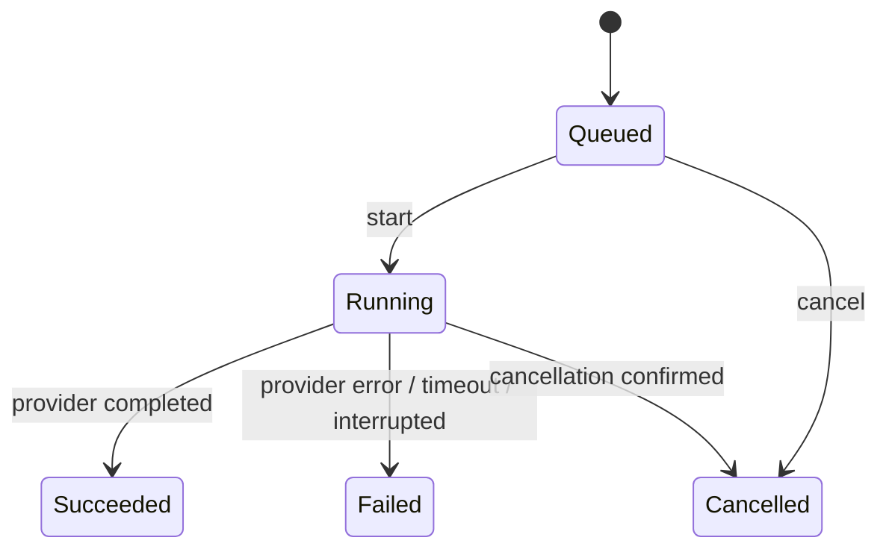

# 作業・モデル実行・成果物のドメインモデル

この文書は、開発作業で何を記録し、どの結果を完了判断に使うかを定義する。主経路では監督Codexが意味的な判断を行い、RustのOperation Serviceは操作要求の検証、実行、状態遷移、制約強制、記録を担当する。

## この文書で決めること

- `Task`、`Attempt`、`Artifact`、Validation、review verdict、監督Codexの判断の区別
- `Attempt` の成功・失敗の意味
- 検証、review、成果物受入、Task完了の関係
- workerを使わず監督Codex自身が編集した場合と、旧データの扱い

Rust型、SQLite migration、MCP transport、ProviderやAI reviewの実装は扱わない。

## 最初に読む要約

| 事実 | 記録するもの | 成功しても意味しないこと |
| --- | --- | --- |
| モデルを1回呼び出した | `Attempt` | 検証成功、要求達成、Task完了 |
| testやlintを実行した | `ValidationResult` | 成果物受入、Task完了 |
| AIにreviewを依頼した | reviewer `Attempt` と `ReviewVerdict` | 監督Codexの受入 |
| 監督Codexが成果物を評価した | `CodexDecision` | publishやTask完了の自動実行 |

この分離により、「モデル呼び出しは成功したがtestは失敗した」「reviewは正常に終わったが修正要求だった」を矛盾なく残せる。

## 用語と全体像

| 用語 | 実装上の名前 | 意味 |
| --- | --- | --- |
| 作業 | `Task` | 利用者の目的を完了まで追跡する単位 |
| モデル実行 | `Attempt` | 指定したProvider / Modelへの1回の呼び出し |
| Model選択 | `ModelChoice` | `Named`の識別子、または明示的な`ProviderDefault` |
| 成果物 | `Artifact` | 管理対象workspaceの特定時点の内容。未コミット変更・新規ファイルを含む |
| 機械検証 | `ValidationResult` | 指定した成果物に対するtest、lint、build等の結果 |
| review結果 | `ReviewVerdict` | reviewerが対象成果物へ返した `approved`、`changes_requested`、`inconclusive` |
| 監督判断 | `CodexDecision` | 監督Codexが対象成果物へ残す `accepted`、`rejected`、`changes_requested` |

```text
Task
  ├─ Attempt 0..N             モデル呼び出しの記録
  │    ├─ input Artifact 0..1
  │    └─ output Artifact 0..1
  ├─ ValidationResult 0..N    Artifactを対象にする
  ├─ ReviewVerdict 0..N       reviewer AttemptとArtifactを結ぶ
  ├─ CodexDecision 0..N       監督CodexとArtifactを結ぶ
  └─ Publication / CI 0..N    Artifact、commit / SHA、PR、checkを結ぶ
```

`Artifact`の同一性は #70、修正Attemptへの入力成果物の引継ぎは #71 を正本とする。過去の記録は上書きしない。

## Attemptはモデル呼び出しだけを表す

AttemptはProvider / Modelを指定して開始した1回のモデル呼び出しである。実装、修正、調査、reviewはroleやrelationで区別するが、モデルを呼んだなら別Attemptとして残す。要求Providerは`provider`、要求Modelは必須の`ModelChoice`として保持する。Model指定なしの意味は`ModelChoice::ProviderDefault`であり、要求からfieldを省略しない。observed Provider / Modelは要求値と別fieldで保持し、Provider結果から実使用Modelを確認できない場合はunknownのままにする。instruction、入力・出力成果物、開始・終了、診断、AgentResult、usage / costも残す。AgentResultは自己申告であり、成功や完了の根拠ではない。

Provider adapterはnamed Modelを対応するCLI / API引数へ渡し、provider defaultではその引数を省略する。`UnsupportedModel`はProviderがModel指定を拒否したことが明確な場合に返す。CLI群が実際に使ったModelを構造化出力で返さない場合、`observed_model`はunknownであり、要求値から複製しない。retryやreworkは新しいAttemptとなるため、Model変更は各Attemptの要求targetとして履歴に残る。

| 状態 | 意味 |
| --- | --- |
| `Queued` | 受け付け済みだが、Provider呼び出しは未開始 |
| `Running` | Provider / Modelを呼び出し中 |
| `Succeeded` | Provider呼び出しが正常終了し、呼び出し結果を記録できた |
| `Failed` | Provider呼び出しが失敗、timeout、または結果を確定できなかった |
| `Cancelled` | 取消と停止を確認した |



`Succeeded` は**モデル呼び出しの正常終了だけ**を表す。検証成功、review承認、監督Codexの受入、Task完了は含まない。Attemptに `Validating` 状態は置かず、Validationの結果でAttemptの終端状態を変更しない。

## 実装・検証・reviewの例

| 順番 | 行ったこと | 記録する事実 |
| --- | --- | --- |
| 1 | 実装モデルを呼び出した | implementer Attempt=`Succeeded`、Artifact A |
| 2 | Artifact Aを検証した | Validation A=`failed`。Attempt 1は変更しない |
| 3 | 修正モデルを呼び出した | implementer Attempt=`Succeeded`、input=A、output=Artifact B |
| 4 | Artifact Bを検証した | Validation B=`passed` |
| 5 | Artifact Bをreviewした | reviewer Attempt=`Succeeded`、ReviewVerdict B=`changes_requested` または `approved` |
| 6 | Artifact Bを採否判断した | 監督Codexが証拠を評価してCodexDecisionを記録 |

reviewerが修正を求めても、reviewの呼び出し自体が正常ならreviewer Attemptは `Succeeded` である。review出力が欠ける・形式不正なら、そのAttemptは無効な出力として扱う。

## 成果物に結び付ける事実

`ValidationResult`はAttemptの状態ではない。対象Artifact、check定義、各checkの終了結果、診断、実行時刻を持つ。passは監督Codexの受入やTask完了を自動発生させず、failはAttemptを失敗へ書き換えない。成果物が変われば、古いValidationを新しい成果物のpublish gateに使えない。

reviewはreviewer roleの通常のAttemptとして実行し、正常なreviewer Attemptは対象ArtifactへのReviewVerdictを1件持てる。`approved` はreviewerの見解であり、`changes_requested` はreview処理の失敗ではない。

監督Codexは差分、Validation、review、CI等を評価し、対象Artifactに次のCodexDecisionを残す。

| 判断 | 意味 |
| --- | --- |
| `accepted` | この成果物を公開または完了判断に進めてよい |
| `rejected` | この成果物は目的に対して採用しない |
| `changes_requested` | 修正または追加調査が必要 |

AI reviewの `approved` は `CodexDecision.accepted` を代替しない。reviewは必須ではなく、監督Codexが必要性を判断する。判断記録には対象Artifact、理由、時刻、参照した証拠を残す。

## Taskの状態と完了

| `TaskState` | 意味 |
| --- | --- |
| `Pending` | 受け付けたが未開始 |
| `Active` | モデル実行、検証、公開、または監督Codexの次の判断を待つ |
| `Completed` | 監督Codexが完了条件を満たすと判断し、Operation Serviceが証拠参照とともに確定した |
| `Failed` | 監督Codexが進められないと判断し、Operation Serviceが確定した |
| `Cancelled` | 継続を明示的に取り消した |

`finish_task` は単一のAttempt、Validation、review verdictだけから自動実行してはならない。監督Codexが目的、採用成果物、必要なValidation、必要ならCI / 公開結果を指定し、Operation Serviceが同一Artifactとpolicyを照合して確定する。

Codex自身が編集した場合はAttemptを作らない。管理済みArtifactに対してValidation、CodexDecision、publish、CI、`finish_task` を順に記録すればよい。

## Operation Serviceとの境界

監督Codexは目的の解釈、Provider / Model選択、実行・review・再試行の要否、成果物の採否、Task完了を判断する。Operation ServiceはTask ID、expected revision、request ID、workspace / Artifactの所属を検証し、操作受付・各事実・公開/CI参照を永続化する。Provider / Model、Validator、GitHub adapterを実行し、stale revision、busy、未知Provider / Model、policy違反、異なるArtifactへの証拠流用を外部副作用前に拒否する。これが #66 のOperation Service契約である。

### Task実行回数budget

Rust API利用側が `TaskExecutionCountBudget` を明示してOperation Serviceへ渡した場合だけ、Task scopeのhard上限を適用する。`None` はbudget無効を表し、Provider観測情報からbudgetを推測しない。現在のmetricは `execution` 単位のService claim数であり、受付transactionと実行claim transactionの両方で検査する。実行claim数は `started_at` のあるOperation数として同じLedgerから読み、claimと同じ即時transactionで上限を再検査するため、同一Operationの再送、並行claim、`recovery_required` への遷移で二重計上しない。上限到達は `BudgetExhausted`、budget未設定は制限なしで区別される。

上限を消費する時点はProvider availability / workspace準備より前のOperation claimである。このためclaim後、Provider呼出し前に失敗した場合も枠を消費する。受付後にService policyが変わってclaim時点で上限超過となったOperationは、即時transactionで `failed` / `budget_exhausted` として終端化し、Taskをbusy状態に残さない。同じOperationを再度runしてもProviderを呼ばず、保存済み失敗を返す。ここで保証するのはOperation Serviceがclaimする回数であり、Provider内の再試行や外部accountのtoken・credit消費量ではない。後者を保証するには別のProvider側制約が必要となる。

## 旧データとの互換性

現行実装と旧Ledgerでは、AttemptはProvider終了後に `Validating` へ進み、旧 `Succeeded` は「検証成功」、旧 `Failed` は「Provider実行または検証失敗」を意味する。この意味を新しいAttemptStateに無断で変換しない。

- migrationは既存の状態、AgentResult、ValidationResult、時刻、診断を消去・上書きしない
- 旧Attemptにはrequested Modelとobserved Provider / Modelの根拠がないため、それらはunknownとして保持する。`ProviderDefault`を推測で補わない
- 旧レコードには `state_semantics_version: legacy_validation_coupled`（名称は実装時に確定）または同等の由来を保存し、旧 `Succeeded` は「当時の検証成功」と読む
- 新規Operation Service経由のAttemptだけを `provider_call_v2` のような新しい意味論で保存し、`Succeeded` を「Provider呼び出し成功」と読む
- 旧Attemptに根拠のないProvider成功、Artifact、verdict、CodexDecisionを推測して追加しない。Artifactを復元できない旧Validationは対象不明として保持する
- 新旧を横断するAPI・集計は意味論バージョンを返すか、比較不能な値を `unknown` として区別する

実際のSQLite schema、backfill可否、wire versionはmigration実装Issueで、既存データを読めるテストとともに決める。Provider trait、MCP JSON schema、GitHub publish、AI review Provider、worktreeの具体的な再利用・cleanup、並列実行はこの文書の対象外である。
