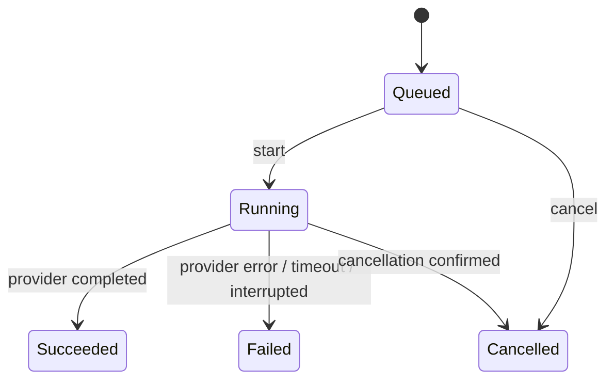

# 作業・モデル実行・成果物のドメインモデル

この文書は、AI Dev Orchestrator が管理する作業、モデル呼び出し、成果物、および検証・判断の最小意味論を定義する。Rust 型、SQLite migration、MCP transport の実装は定義しない。主経路の判断主体は監督Codexであり、Rust の Operation Service は操作の検証、状態遷移、制約強制、実行、記録を担う。

## 用語と責務境界

| 用語 | 実装上の名前 | 意味 |
| --- | --- | --- |
| 作業 | `Task` | 利用者の目的を完了まで追跡する単位。監督Codexが達成を判断し、Operation Service が終端遷移を記録する。 |
| モデル実行 | `Attempt` | 指定した Provider / Model への**1回の呼び出し**。 |
| 成果物 | `Artifact` | 管理対象workspaceの特定時点の内容。未コミット変更・新規ファイルを含めて識別する。 |
| 機械検証 | `ValidationResult` | 指定した成果物に対する test、lint、build 等の結果。 |
| review verdict | `ReviewVerdict` | reviewer Attempt が対象成果物について返した `approved`、`changes_requested`、`inconclusive`。 |
| 監督判断 | `CodexDecision` | 監督Codexが対象成果物を `accepted`、`rejected`、`changes_requested` とした記録。 |

```text
Task
  ├─ Attempt 0..N             モデル呼び出しの記録
  │    ├─ input Artifact 0..1
  │    └─ output Artifact 0..1
  ├─ ValidationResult 0..N    Artifact を対象にする
  ├─ ReviewVerdict 0..N       reviewer Attempt と Artifact を結ぶ
  ├─ CodexDecision 0..N       監督Codexと Artifact を結ぶ
  └─ Publication / CI 0..N    Artifact、commit / SHA、PR、check を結ぶ
```

`Artifact` は #70 の成果物同一性の正本に従う。#71 の修正 Attempt は監督Codexが指定した前回 `Artifact` を入力にし、新しい出力 `Artifact` を残す。過去の記録は上書きしない。

## Attempt はモデル呼び出しだけを表す

Attempt は Provider / Model を指定して開始した1回のモデル呼び出しである。実装、修正、調査、review は role / relation で区別できるが、モデルを呼んだなら1 Attempt である。Codex自身が編集した場合や、Validator・GitHub adapter だけを呼ぶ場合には Attempt を作らない。

Attempt は要求・実測 Provider / Model、instruction、入力・出力成果物、開始・終了、診断、AgentResult、usage / cost、および呼び出しの終了結果を保持する。AgentResult は自己申告であり、成功や完了の根拠ではない。

### AttemptState

| 状態 | 意味 |
| --- | --- |
| `Queued` | 実行は受け付け済みだが、Provider 呼び出しは未開始 |
| `Running` | Provider / Model を呼び出し中 |
| `Succeeded` | Provider 呼び出しが正常終了し、呼び出し結果を記録できた |
| `Failed` | Provider 呼び出しが失敗、timeout、または結果を確定できなかった |
| `Cancelled` | 呼び出しの取消と停止を確認した |



`Succeeded` は**モデル呼び出しの正常終了だけ**を表す。成果物が要求を満たすこと、検証が通ること、review が承認すること、監督Codexが受け入れること、Task が完了することは意味しない。Attempt に `Validating` 状態は置かず、Validation によって Attempt の終端状態を変えない。

| 事実 | 記録 |
| --- | --- |
| モデルが正常終了したが test が失敗した | Attempt=`Succeeded`、対象 Artifact の Validation=`failed` |
| reviewer が正常に応答し修正を要求した | reviewer Attempt=`Succeeded`、ReviewVerdict=`changes_requested` |
| Provider が timeout した | Attempt=`Failed`。Validation / verdict は作らない |

## 成果物に束縛する別々の事実

### Validation

`ValidationResult` は Attempt の状態ではない。必ず対象 `Artifact`、check 定義、各 check の終了結果、診断、実行時刻を持つ。Attempt が出力した成果物に対して行ってもよいが、Codex自身が編集した成果物にも作れる。pass は Codex の受入や Task 完了を自動発生させず、fail は Attempt を失敗へ書き換えない。成果物が変われば古い Validation は新しい成果物の publish gate に使えない。

### AI review と監督Codexの判断

review は reviewer role の通常の Attempt として実行する。その Attempt が正常終了した場合に限り、対象 Artifact への `ReviewVerdict` を1件記録できる。`approved` は reviewer の見解であり、`changes_requested` は review 処理が失敗した意味ではない。verdict が欠ける・形式不正なら review Attempt の無効な出力として扱う。

`CodexDecision` は監督Codexが差分、Validation、review、CI等の証拠を評価して対象 Artifact へ残す判断である。

| 判断 | 意味 |
| --- | --- |
| `accepted` | この成果物を公開または完了判断に進めてよい |
| `rejected` | この成果物は目的に対して採用しない |
| `changes_requested` | 修正または追加調査が必要 |

AI review の `approved` は `CodexDecision.accepted` を代替しない。監督Codexはreviewを必須にしない。判断には対象 Artifact、理由、時刻、参照した証拠を残す。

## 作業の状態と完了

| `TaskState` | 意味 |
| --- | --- |
| `Pending` | 受け付けたが未開始 |
| `Active` | モデル実行、検証、公開、または監督Codexの次の判断を待つ |
| `Completed` | 監督Codexが完了条件を満たすと判断し、Operation Service が証拠参照とともに確定した |
| `Failed` | 監督Codexが進められないと判断し、Operation Service が確定した |
| `Cancelled` | 継続を明示的に取り消した |

`finish_task` は単一の Attempt、Validation、AI review verdict だけから自動実行してはならない。監督Codexが目的、採用成果物、必要な Validation、必要なら CI / 公開結果を指定し、Operation Service が同一 Artifact と policy を照合して確定する。従って workerを使わず Codex自身が編集した Task も、管理済み Artifact に対する Validation、CodexDecision、publish、CI、`finish_task` の順で扱える。

## Operation Service との境界

監督Codexは目的の解釈、Provider / Model 選択、実行・review・再試行の要否、成果物の採否、Task完了を判断する。Operation Service は Task ID、expected revision、request ID、workspace / Artifact の所属を検証し、操作受付・各事実・公開/CI参照を永続化する。Provider / Model、Validator、GitHub adapter を実行し、観測した成功・失敗・取消を記録する。stale revision、busy、未知 Provider / Model、policy 違反、異なる Artifact への証拠流用は外部副作用前に拒否する。

これが #66 の Operation Service 契約である。#70 は Artifact と Validation / verdict / decision / publication の束縛を、#71 は Attempt の input / output Artifact と修正の系譜を実装する。API、DB schema、並列化方式は各Issueで決める。

## 旧データとの互換性

現行実装と旧Ledgerでは Attempt は Provider 終了後に `Validating` へ進み、旧 `Succeeded` は「検証成功」、旧 `Failed` は「Provider実行または検証失敗」を意味する。この意味を新しい AttemptState に無断で変換しない。

- migration は既存の状態、AgentResult、ValidationResult、時刻、診断を消去・上書きしない。
- 旧レコードには `state_semantics_version: legacy_validation_coupled`（実装時に命名確定）または同等の由来を保存する。旧 `Succeeded` は「当時の検証成功」と読む。
- 新規 Operation Service 経由の Attempt だけを `provider_call_v2` のような新しい意味論で保存し、`Succeeded` を「Provider呼び出し成功」と読む。
- 旧 Attempt に根拠のない Provider成功、Artifact、verdict、CodexDecisionを推測して追加しない。Artifact を復元できない旧 Validation は対象不明として保持する。
- 新旧を横断するAPI・集計は意味論バージョンを返すか、比較不能な値を `unknown` として区別する。旧の検証成功を新しいモデル実行成功の件数へ混ぜない。

実際のSQLite schema、backfill可否、wire version は migration 実装 Issue で既存データを読めるテストとともに決める。Provider trait、MCP JSON schema、GitHub publish、AI review Provider、worktreeの具体的再利用・cleanup、並列実行は対象外である。
