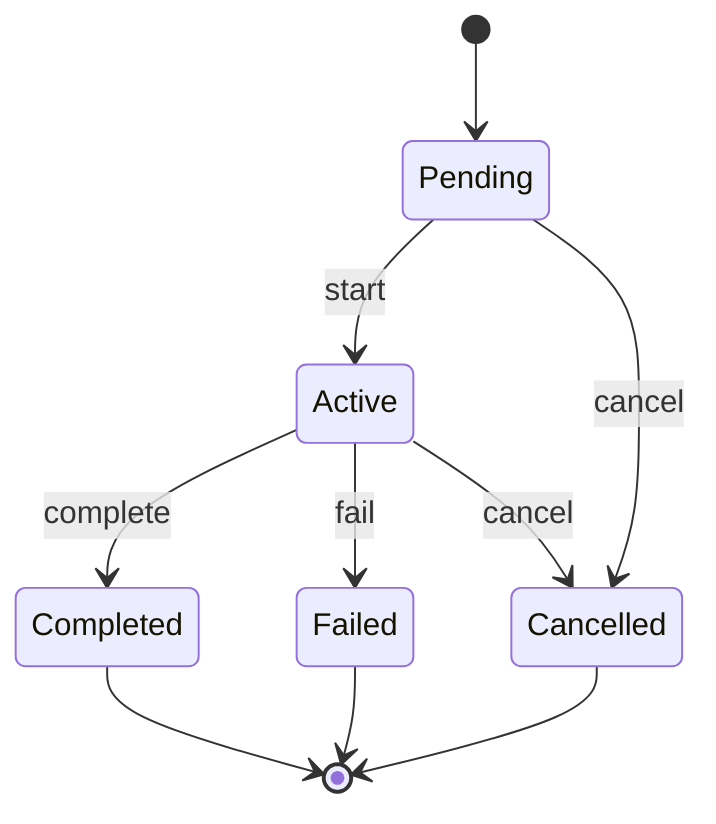
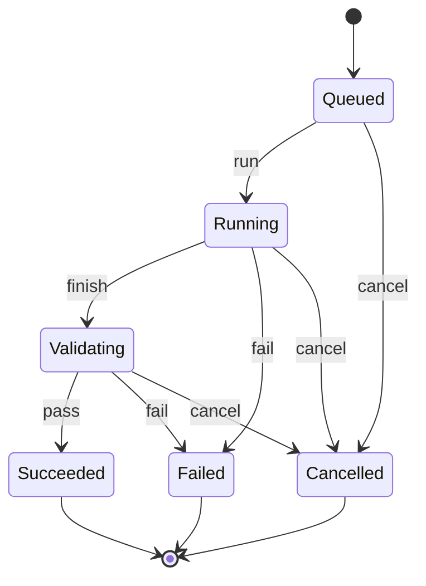

# Task / Attempt ドメインモデル

この文書は、AI Dev Orchestrator が管理する仕事と実行記録の最小ドメインモデルを定義する。Provider、MCP、Runtime Adapter の具体的なインターフェースは定義しない。Execution Ledger の永続化境界は別途定義する。

## 設計方針

- `Task` は「何を達成する仕事か」を表す。特定の Provider による一度の実行は表さない。
- `Attempt` は、ある Task をある Provider で一度実行した記録である。retry や escalation は新しい Attempt として記録する。
- `Task` と `Attempt` は 1:N の関係を持つ。Task は 0 個以上の Attempt を持ち、各 Attempt は必ず 1 個の Task に属する。
- `Role` と `Provider` は分離する。Task は `TaskRole` を持つが、Provider は Attempt ごとに選択する。
- Agent の自己申告は `AgentResult`、機械的な検証は `ValidationResult` として別々に記録する。AgentResult は成功判定の正本ではない。
- retry / escalation は状態ではなく、失敗した Attempt の後に Planner が次の Attempt を作るという意味的な判断である。Orchestrator は、その判断を受けて確定的な制約と状態遷移を適用する。

## 概念モデル

```text
Task
  ├─ id
  ├─ description / constraints
  ├─ TaskRole
  ├─ TaskState
  └─ Attempt 0..N
       ├─ id
       ├─ Provider
       ├─ AttemptState
       ├─ AgentResult 0..1
       ├─ ValidationResult 0..N
       └─ Usage / Cost 0..1
```

### Task

Task は利用者または Planner が依頼した仕事の同一性、目的、制約、役割、仕事全体の状態を保持する。

Task は Provider、pane ID、session ID、CLI 引数、個別 Attempt の結果や利用量を保持しない。実行に関する情報は Attempt に属する。

### Attempt

Attempt は Task に対する一回の実行単位であり、使用した Provider、実行状態、AgentResult、ValidationResult、Usage / Cost を保持する。同じ Task の retry や escalation は別の Attempt とするため、過去の実行履歴を失わない。

Provider は Attempt にだけ紐づく。`TaskRole` は `developer`、`reviewer`、`explorer` など「期待する責務」を表し、具体的な Provider の選択は Planner が行う。

### AgentResult と ValidationResult

`AgentResult` は Agent が返した報告（実装内容、提案された完了状態、問題、参照情報など）である。報告の存在や「成功した」という自己申告だけでは Task / Attempt を成功にしない。

`ValidationResult` は Validator が実行した test、lint、build 等の機械的な結果を表す aggregate であり、各 `ValidationCheckResult` に check 名、合否、終了 status、diagnostics を保持する。Orchestrator は ValidationResult を入力として Attempt の確定状態を更新する。意味的な retry / escalation や要求に対する妥当性判断は Planner の責務であり、Validator の責務ではない。

### Usage / Cost

Usage / Cost は実行に紐づくため Attempt が所有する。v0 では token 数、金額、subscription quota などを一つの数値へ潰さず、Provider が報告できる任意の内訳と単位を保持できる値として扱う。Task 集計値は正本にせず、必要になった時点で Attempt から導出する。

## 状態と許可される遷移

状態の変更は Orchestrator が検証し、不正な遷移を Rust 側で拒否する。Planner や Agent は状態を直接書き換えず、意図または結果を Orchestrator に渡す。

### TaskState の状態遷移図



`Completed`、`Failed`、`Cancelled` は終端状態であり、そこからの遷移はない。Attempt の失敗後に retry / escalation する場合は `Active` のまま次の Attempt を追加する。

### TaskState

| 状態 | 意味 |
| --- | --- |
| `Pending` | 実行開始前。Attempt はまだ存在しないか、開始条件を満たしていない |
| `Active` | 少なくとも一つの Attempt を処理中 |
| `Completed` | Task の目的に対する確定処理が完了した。再開不可 |
| `Failed` | 許可された実行を終えたが、Task を完了できなかった。再開不可 |
| `Cancelled` | Task の継続を明示的に取り消した。再開不可 |

許可する遷移は次の通り。

```text
Pending ──start──> Active
Pending ──cancel─> Cancelled
Active  ──complete-> Completed
Active  ──fail───-> Failed
Active  ──cancel─> Cancelled
```

`Completed`、`Failed`、`Cancelled` からの遷移は許可しない。Attempt の失敗後に retry / escalation する場合も Task は `Active` のまま、新しい Attempt を追加する。Planner がこれ以上の試行を行わないと決めた場合に限り、Orchestrator が `Failed` への遷移を適用する。

### AttemptState

| 状態 | 意味 |
| --- | --- |
| `Queued` | 実行対象として作成済みだが、Provider の実行は未開始 |
| `Running` | Provider による実行中 |
| `Validating` | Agent の実行結果を受け、Validator による機械的検証中 |
| `Succeeded` | この Attempt の検証が成功した |
| `Failed` | Provider 実行または検証が失敗した |
| `Cancelled` | この Attempt の継続を取り消した |

### AttemptState の状態遷移図



許可する遷移は次の通り。

```text
Queued     ──run────> Running
Queued     ──cancel─> Cancelled
Running    ──finish─> Validating
Running    ──fail───> Failed
Running    ──cancel─> Cancelled
Validating ──pass───> Succeeded
Validating ──fail───> Failed
Validating ──cancel─> Cancelled
```

`AgentFinished` のような中間状態は v0 では追加しない。Agent の返却は AgentResult として記録し、検証へ進める操作で `Running -> Validating` とする。終了状態からの遷移は許可しない。

Attempt が `Failed` になっても Task は自動的に `Failed` にならない。Planner が retry / escalation の必要性を判断し、次の Attempt を作成する。検証成功後に Task を `Completed` とするか、追加の意味的判断を必要とするかは、Orchestrator が定めるポリシーに従って決定するが、AgentResult 単独では決定しない。

次の Attempt の処理内容は、失敗の原因に応じて Planner が決める。例えば、同じ worktree のコードを修正して再検証する「再実装」、別 Provider へ切り替える「escalation」、入力や制約を見直して再実行する処理などがあり得る。これらはすべて新しい Attempt として記録し、失敗した Attempt の状態を `Succeeded` に戻したり、失敗した Attempt 自体に再実装の結果を上書きしたりしない。

## cancellation

Task の cancellation は Task と、その時点で終了していない Attempt に適用する。Task が `Cancelled` になった後は、新しい Attempt を作成できない。実行中の Attempt は個別の停止結果を記録した上で `Cancelled` へ遷移する。

Attempt だけを取り消す場合は、Task は `Active` のまま維持できる。別の Attempt が実行中でない場合に Task をどう終えるかは、Planner の判断を Orchestrator の `Failed` または `Cancelled` 遷移として適用する。

## Runtime との境界

Herdr の pane ID、session ID、プロセス ID、Provider CLI の引数などは Runtime / Provider Adapter の責務であり、Core Domain の Task / Attempt の属性にはしない。必要な場合は Adapter 側の実行コンテキストや外部参照として扱い、Core Domain の状態遷移から分離する。

## v0 の範囲

v0 では Task、Attempt、TaskRole、Provider 参照、TaskState、AttemptState、AgentResult、ValidationResult、Usage / Cost、cancellation と状態遷移のルールを扱う。ローカルの Execution Ledger は SQLite にこれらの実行履歴と開始・終了時刻を保存する。Provider 選択は `PlannerRequest` / `PlannerDecision` として別境界に置き、Rust の Provider availability 検証と Codex Planner adapter は Core Domain の状態遷移から分離する。MCP JSON schema、Provider trait、Herdr Adapter、worktree 管理、retry / routing policy は引き続き対象外である。

親子 Task、Task dependency、DAG、複雑な並列実行、Attempt ごとの新規 workspace 作成・再利用方針は本モデルに含めず、必要になった時点で別 Issue として決定する。

## 未解決事項

- `TaskRole` の固定 enum 化または拡張可能な識別子化は、Provider / Planner の契約を設計する Issue で決定する。
- token、金額、quota の正確な単位と換算規則は、Provider 共通の Usage / Cost 契約を設計する Issue で決定する。
- Attempt の失敗理由を型付き error として保持するかは、永続化と診断情報の設計時に決定する。
- retry 時に同一 worktree を再利用するかは、Workspace / Runtime Adapter の設計時に決定する。
