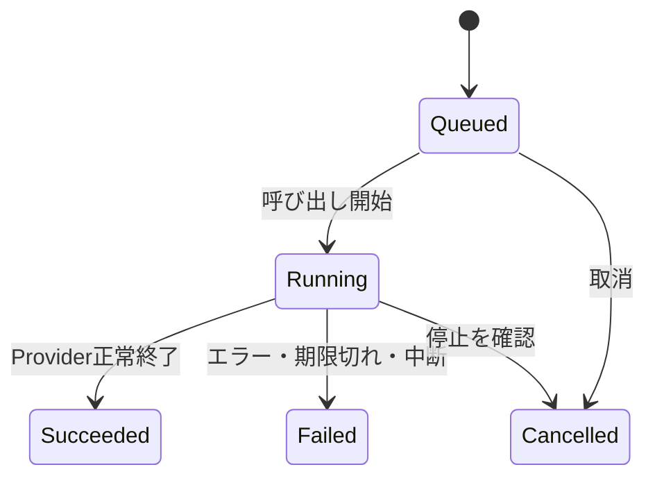

# 作業・モデル実行・成果物のドメインモデル

全体の構成を知るには、先に[開発支援システムの全体像](architecture.md)を読んでください。この文書は、その構成の中で開発作業の何を記録し、どの結果を完了判断に使うかを定義します。

この文書を読むと、モデル呼び出し、機械検証、AIレビュー、監督Codexの判断をどう区別するか、また、それぞれをどの成果物に結び付けるかが分かります。主経路では監督Codexが意味的な判断を行い、RustのOperation Service（操作を実行・記録する共通処理）は要求の検証、実行、状態遷移、制約の強制、記録を担当します。

## この文書で決めること

- `Task`、`Attempt`、`Artifact`、Validation、レビュー結果、監督Codexの判断の区別
- `Attempt` の成功・失敗の意味
- 検証、レビュー、成果物受入、Task完了の関係
- 実装担当モデルを呼ばず監督Codex自身が編集した場合と、旧データの扱い

Rustの型、SQLiteのデータベース変更、MCP通信形式、ProviderやAIレビューの実装方法は扱いません。これらは接続設計や個別の仕様を参照してください。

## 最初に読む要約

| 事実 | 記録するもの | 成功しても意味しないこと |
| --- | --- | --- |
| モデルを1回呼び出した | `Attempt` | 検証成功、要求達成、Task完了 |
| テストやlint（静的チェック）を実行した | `ValidationResult` | 成果物受入、Task完了 |
| AIにレビューを依頼した | レビュー担当 `Attempt` と `ReviewVerdict` | 監督Codexの受入 |
| 監督Codexが成果物を評価した | `CodexDecision` | 公開やTask完了の自動実行 |

この分け方なら、「モデル呼び出しは成功したがテストは失敗した」「レビューは正常に終わったが修正要求だった」という別々の事実を、そのまま記録できます。

## 用語と全体像

| 用語 | 実装上の名前 | 意味 |
| --- | --- | --- |
| 作業 | `Task` | 利用者の目的を完了まで追跡する単位 |
| モデル実行 | `Attempt` | 指定したProvider（実行先）とModel（モデル名）への1回の呼び出し |
| 成果物 | `Artifact` | 管理対象の作業場所の内容を固定した記録。未コミット変更と通常の新規ファイルを含み、Gitが無視する新規ファイルは含めない（#70） |
| 機械検証 | `ValidationResult` | 指定した成果物に対するテスト、静的チェック、ビルド等の結果 |
| レビュー結果 | `ReviewVerdict` | レビュー担当が対象成果物へ返した `approved`、`changes_requested`、`inconclusive` |
| 監督判断 | `CodexDecision` | 監督Codexが対象成果物へ残す `accepted`、`rejected`、`changes_requested` |

```text
Task
  ├─ Attempt 0..N             モデル呼び出しの記録
  │    ├─ 入力Artifact 0..1
  │    └─ 出力Artifact 0..1
  ├─ ValidationResult 0..N    Artifactを対象にする
  ├─ ReviewVerdict 0..N       reviewer AttemptとArtifactを結ぶ
  ├─ CodexDecision 0..N       監督CodexとArtifactを結ぶ
  └─ 公開（Publication）/ CI 0..N  Artifact、commit / SHA、PR、checkを結ぶ
```

CI（継続的インテグレーション）は公開した変更を自動検査する処理です。`SHA`はコミットを特定する識別子、`PR`はPull Request（変更提案）を指します。

`Artifact`（保存済み成果物）の同一性はIssue #70、修正Attemptへ入力成果物を引き継ぐ規則はIssue #71を正本とします。いずれの場合も、過去の記録は上書きしません。

## Attemptはモデル呼び出しだけを表す

Attemptは指定したProvider / Modelを呼び出す1回の処理です。実装、修正、調査、レビューの違いは担当（role）や履歴の関係（relation）で表します。モデルを呼び出すたびに、別のAttemptを記録します。

Attemptには、要求したProvider / Modelと実際に使ったProvider / Model、モデルへの指示（instruction）、入力・出力Artifact、開始・終了時刻、診断を記録します。利用量・費用（usage / cost）も記録します。AgentResult（モデルが返した作業報告）は自己申告なので、それだけで成功や完了とは判定しません。

| 状態 | 意味 |
| --- | --- |
| `Queued` | 受け付け済みだが、Provider呼び出しは未開始 |
| `Running` | Provider / Modelを呼び出し中 |
| `Succeeded` | Provider呼び出しが正常終了し、呼び出し結果を記録できた |
| `Failed` | Provider呼び出しが失敗、時間切れ、または結果を確定できなかった |
| `Cancelled` | 取消と停止を確認した |


```mermaid
stateDiagram-v2
    [*] --> Queued
    Queued --> Running: 呼び出し開始
    Queued --> Cancelled: 取消
    Running --> Succeeded: Provider正常終了
    Running --> Failed: エラー・期限切れ・中断
    Running --> Cancelled: 停止を確認
```

`Queued`は受付済み、`Running`はProvider呼び出し中、`Succeeded`は正常終了、`Failed`は失敗または結果を確定できない状態、`Cancelled`は取消後に停止を確認した状態です。

`Succeeded` は**モデル呼び出しが正常に終わったことだけ**を表します。テストなどの検証成功、レビュー承認、監督Codexの受入、Task完了を意味しません。`Attempt`に`Validating`（検証中）状態は設けず、Validationの結果でAttemptの終端状態を書き換えません。

## 実装・検証・任意レビューの例

| 順番 | 行ったこと | 記録する事実 |
| --- | --- | --- |
| 1 | 実装モデルを呼び出した | 実装担当 Attempt=`Succeeded`、Artifact A |
| 2 | Artifact Aを検証した | Validation A=`failed`。Attempt 1は変更しない |
| 3 | Validation失敗後、レビューを挟まず修正モデルを呼び出した | 実装担当 Attempt=`Succeeded`、relation=`SpecifiedInput`（参照先はArtifact Aの作成Attempt）、input=A、output=Artifact B |
| 4 | Artifact Bを検証した | Validation B=`passed` |
| 5 | Artifact Bをレビューした | レビュー担当 Attempt=`Succeeded`、ReviewVerdict B=`changes_requested` または `approved` |
| 6 | Artifact Bを採否判断した | 監督Codexが証拠を評価してCodexDecisionを記録 |

レビューは任意であり、Validation後や修正前の必須段階ではない。レビューを行って修正を求めても、レビューの呼び出し自体が正常ならレビュー担当 Attemptは `Succeeded` である。レビュー出力が欠ける・形式不正なら、そのAttemptは無効な出力として扱う。

## 成果物に結び付ける事実

`ValidationResult`はAttemptの状態ではありません。どのArtifactを対象にしたか、実行したcheck（検査）の定義と終了結果、診断、実行時刻を記録します。checkがすべて成功しても監督Codexの受入やTask完了は自動で発生しません。失敗してもAttemptを失敗に書き換えません。成果物が変わった後に、以前のValidationを新しい成果物の公開条件として使うこともできません。

レビューは任意です。実行する場合、レビュー担当（`reviewer`）のモデル呼び出しも通常のAttemptとして記録します。正常に終わったレビュー担当 Attemptには、対象ArtifactへのReviewVerdict（レビュー結果）を1件記録できます。

レビュー担当が確認するArtifactやその作成元Attemptが履歴から分からない場合、参照先を推定しません。同じTaskの現在の成果物の作成元が、成功済みの実装担当のモデル実行と確認できる場合は`ReviewOf`を使います。それ以外の一般レビューは`SpecifiedInput`とし、ArtifactInput（既存Artifactを入力として指定する記録）に同一Task内の作成元Attemptがあれば、その参照を保ちます。レビュー担当がBaseInputを受け取る場合も`SpecifiedInput`ですが、Artifactを対象とするReviewVerdictは作りません。

`approved`（承認）はレビュー担当の見解です。監督Codexによる成果物受入を意味しません。`changes_requested`（修正要求）もレビュー処理の失敗ではありません。

Attemptの履歴分類の詳細は[実装・レビュー・修正を記録する設計](implementation-review-model.md)を参照してください。ここでは、分類の要点を示します。

- `Initial`（初回実装）は、新しいTaskのsequence 1で、BaseInput（指定したGitコミットから開始する入力）から始める実装担当だけに使います。
- `SpecifiedInput`（指定入力からの実行）は、調査担当、レビュー担当、`Initial`に該当しないBaseInput（後続実行など）、レビューを経ない修正、作成元Attemptが分からないArtifactへのレビューなど、既存の理由分類に当てはまらない新規実行に使います。
- `SpecifiedInput`の入力は既存のAttempt input欄に一度だけ保存します。ArtifactInputに同じTask内の作成元Attemptが記録されていれば、その`related_attempt_id`（参照Attempt ID）を必ず保持します。分類理由が不明でも、分かっている作成元Attemptをnullにしません。
- `BaseInput`には参照先を設定しません。BaseInputと過去のArtifactのcommitが一致しても、Attemptとの関係を推定しません。
- `attempt.run`（Attempt実行）の一般要求には再試行やレビュー指摘への修正の理由を指定する入力項目がありません。Provider / Modelの違いや直前のValidation・レビューだけから、再試行や修正の理由を推定しません。
- 移行では既存のrelation（履歴関係）と参照先をそのまま保持し、新しい規則で再分類しません。既存関係を復元できない旧履歴だけ`LegacyUnspecified`（移行前の関係不明）とします。

監督Codexは差分、Validation、レビュー、CIなどの証拠を評価し、対象ArtifactにCodexDecision（監督判断）を記録します。

| 判断 | 意味 |
| --- | --- |
| `accepted` | この成果物を公開または完了判断に進めてよい |
| `rejected` | この成果物は目的に対して採用しない |
| `changes_requested` | 修正または追加調査が必要 |

AIレビューの`approved`は`CodexDecision.accepted`（監督Codexによる受入）を代替しません。レビューは必須ではなく、必要性は監督Codexが判断します。判断記録には対象Artifact、理由、時刻、参照した証拠を残します。

## Taskの状態と完了

Task（作業）の状態は、作業全体がどこまで進んだかを示します。Attemptの状態とは別に管理します。

| `TaskState` | 意味 |
| --- | --- |
| `Pending`（未開始） | 受け付けたが、まだ処理を始めていない |
| `Active`（進行中） | モデル実行、検証、公開、または監督Codexの次の判断を待っている |
| `Completed`（完了） | 監督Codexが完了条件を満たすと判断し、Operation Serviceが証拠参照とともに確定した |
| `Failed`（失敗） | 監督Codexが続行できないと判断し、Operation Serviceが確定した |
| `Cancelled`（取消） | 作業の継続を明示的に取り消した |

`finish_task`（Task完了の確定）は、単一のAttempt、Validation、ReviewVerdictだけを根拠に自動実行しません。監督Codexが目的と採用するArtifactを示し、必要なValidationやCI・公開結果を指定します。Operation Serviceは、指定された証拠が同じArtifactとpolicy（適用規則）に対応することを確認して、完了を確定します。

監督Codex自身が直接編集した場合は、モデル呼び出しがないためAttemptを作りません。管理対象のArtifactに対するValidation、CodexDecision、公開、CIの結果、`finish_task`を順に記録します。

## Operation Serviceとの境界

監督Codexは、目的の解釈、Provider / Model（実行先とモデル）の選択、実行・レビュー・再試行を行うか、成果物を採用するか、Taskを完了するかを判断します。

Operation Serviceは、Task ID、expected revision（要求側が最後に確認したTaskの更新番号）、request ID（再送識別子）、workspaceとArtifactの所属を検証します。操作の受付、結果、公開・CIの参照も記録します。必要に応じてProvider / Model、Validator（機械検査）、GitHub adapter（GitHub接続処理）を実行します。

Serviceは、stale revision（古いTaskの更新番号）、busy（操作ごとの条件で競合と判定された状態）、未登録のProvider / Model、policy違反、別Artifactの証拠の流用を、外部副作用の前に拒否します。これがIssue #66のOperation Service契約です。

## 旧データとの互換性

旧Ledger（記録用データベース）では、AttemptはProvider終了後に`Validating`（検証中）へ進む場合があります。その形式での`Succeeded`は「Provider呼び出し成功」ではなく「検証成功」を、`Failed`は「Provider実行または検証の失敗」を意味します。新しいAttemptState（Attemptの状態）へ移す場合も、この意味を無断で置き換えません。

- データ移行では、旧レコードの状態、AgentResult（Agentの自己申告結果）、ValidationResult、時刻、診断を消去・上書きしません。
- 旧レコードには`state_semantics_version: legacy_validation_coupled`（旧状態がValidationに連動したことを示す識別子。名称は実装時に確定）または同等の由来を保存します。旧`Succeeded`は当時の「検証成功」として読みます。
- 新規Operation Service経由のAttemptには、`provider_call_v2`のような識別子で新しい意味を記録します。この場合の`Succeeded`は「Provider呼び出し成功」を表します。
- 旧Attemptに、根拠のないProvider成功、Artifact、レビュー結果、CodexDecisionを推測で追加しません。対応するArtifactが復元できない旧Validationは、対象不明の記録として保持します。
- 新旧データを同じAPIや集計で扱う場合は、意味の版を返すか、直接比較できない値を`unknown`（不明）として区別します。

SQLiteの実際のデータ構造、既存行への値補完が可能か、通信形式の版は、既存データを読めるテストとともに移行実装Issueで決めます。

実行先の共通インターフェース、MCPのJSON入力・出力形式、GitHub公開処理、AIレビュー Provider、worktree（作業ディレクトリ）の再利用・後片付け、並列実行は、この文書の対象外です。
