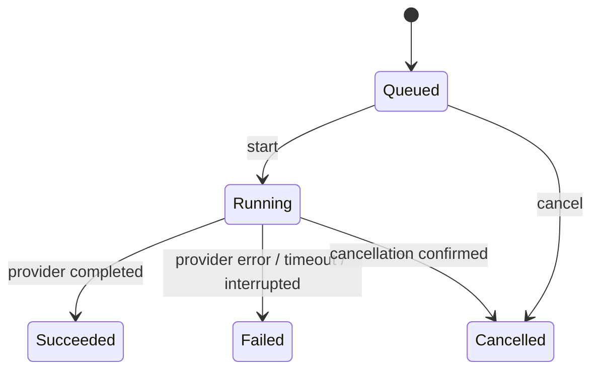

# 作業・モデル実行・成果物のドメインモデル

この文書は、開発作業で何を記録し、どの結果を完了判断に使うかを定義する。主経路では監督Codexが意味的な判断を行い、RustのOperation Serviceは操作要求の検証、実行、状態遷移、制約強制、記録を担当する。

## この文書で決めること

- `Task`、`Attempt`、`Artifact`、Validation、review verdict、監督Codexの判断の区別
- `Attempt` の成功・失敗の意味
- 検証、review、成果物受入、Task完了の関係
- workerを使わず監督Codex自身が編集した場合と、旧データの扱い

Rust型、SQLite migration、MCP transport、ProviderやAI reviewの実装は扱わない。

## 最初に読む要約

| 事実 | 記録するもの | 成功しても意味しないこと |
| --- | --- | --- |
| モデルを1回呼び出した | `Attempt` | 検証成功、要求達成、Task完了 |
| testやlintを実行した | `ValidationResult` | 成果物受入、Task完了 |
| AIにreviewを依頼した | reviewer `Attempt` と `ReviewVerdict` | 監督Codexの受入 |
| 監督Codexが成果物を評価した | `CodexDecision` | publishやTask完了の自動実行 |

この分離により、「モデル呼び出しは成功したがtestは失敗した」「reviewは正常に終わったが修正要求だった」を矛盾なく残せる。

## 用語と全体像

| 用語 | 実装上の名前 | 意味 |
| --- | --- | --- |
| 作業 | `Task` | 利用者の目的を完了まで追跡する単位 |
| モデル実行 | `Attempt` | 指定したProvider / Modelへの1回の呼び出し |
| Model選択 | `ModelChoice` | `Named`の識別子、または明示的な`ProviderDefault` |
| 成果物 | `Artifact` | 管理対象workspaceの特定時点の内容。tracked変更とignoredでない新規ファイルを含み、ignoredファイルは意図的に除外する |
| 機械検証 | `ValidationResult` | 指定した成果物に対するtest、lint、build等の結果 |
| review結果 | `ReviewVerdict` | reviewerが対象成果物へ返した `approved`、`changes_requested`、`inconclusive` |
| 監督判断 | `CodexDecision` | 監督Codexが対象成果物へ残す `accepted`、`rejected`、`changes_requested` |

```text
Task
  ├─ Attempt 0..N             モデル呼び出しの記録
  │    ├─ input Artifact 0..1
  │    └─ output Artifact 0..1
  ├─ ValidationResult 0..N    Artifactを対象にする
  ├─ ReviewVerdict 0..N       reviewer AttemptとArtifactを結ぶ
  ├─ CodexDecision 0..N       監督CodexとArtifactを結ぶ
  └─ Publication / CI 0..N    Artifact、commit / SHA、PR、checkを結ぶ
```

`Artifact`の同一性は #70、修正Attemptへの入力成果物の引継ぎは #71 を正本とする。過去の記録は上書きしない。

## Attemptはモデル呼び出しだけを表す

AttemptはProvider / Modelを指定して開始した1回のモデル呼び出しである。実装、修正、調査、reviewはroleやrelationで区別するが、モデルを呼んだなら別Attemptとして残す。要求Providerは`provider`、要求Modelは必須の`ModelChoice`として保持する。Model指定なしの意味は`ModelChoice::ProviderDefault`であり、要求からfieldを省略しない。observed Provider / Modelは要求値と別fieldで保持し、Provider結果から実使用Modelを確認できない場合はunknownのままにする。instruction、入力・出力成果物、開始・終了、診断、AgentResult、usage / costも残す。AgentResultは自己申告であり、成功や完了の根拠ではない。

Provider adapterはnamed Modelを対応するCLI / API引数へ渡し、provider defaultではその引数を省略する。`UnsupportedModel`はProviderがModel指定を拒否したことが明確な場合に返す。CLI群が実際に使ったModelを構造化出力で返さない場合、`observed_model`はunknownであり、要求値から複製しない。retryやreworkは新しいAttemptとなるため、Model変更は各Attemptの要求targetとして履歴に残る。

| 状態 | 意味 |
| --- | --- |
| `Queued` | 受け付け済みだが、Provider呼び出しは未開始 |
| `Running` | Provider / Modelを呼び出し中 |
| `Succeeded` | Provider呼び出しが正常終了し、呼び出し結果を記録できた |
| `Failed` | Provider呼び出しが失敗、timeout、または結果を確定できなかった |
| `Cancelled` | 取消と停止を確認した |


```mermaid
stateDiagram-v2
    [*] --> Queued
    Queued --> Running: start
    Queued --> Cancelled: cancel
    Running --> Succeeded: provider completed
    Running --> Failed: provider error / timeout / interrupted
    Running --> Cancelled: cancellation confirmed
```

`Succeeded` は**モデル呼び出しの正常終了だけ**を表す。検証成功、review承認、監督Codexの受入、Task完了は含まない。Attemptに `Validating` 状態は置かず、Validationの結果でAttemptの終端状態を変更しない。

## 実装・検証・reviewの例

| 順番 | 行ったこと | 記録する事実 |
| --- | --- | --- |
| 1 | 実装モデルを呼び出した | implementer Attempt=`Succeeded`、Artifact A |
| 2 | Artifact Aを検証した | Validation A=`failed`。Attempt 1は変更しない |
| 3 | 修正モデルを呼び出した | implementer Attempt=`Succeeded`、input=A、output=Artifact B |
| 4 | Artifact Bを検証した | Validation B=`passed` |
| 5 | Artifact Bをreviewした | reviewer Attempt=`Succeeded`、ReviewVerdict B=`changes_requested` または `approved` |
| 6 | Artifact Bを採否判断した | 監督Codexが証拠を評価してCodexDecisionを記録 |

reviewerが修正を求めても、reviewの呼び出し自体が正常ならreviewer Attemptは `Succeeded` である。review出力が欠ける・形式不正なら、そのAttemptは無効な出力として扱う。

## 成果物に結び付ける事実

`ValidationResult`はAttemptの状態ではない。対象Artifact、check定義、各checkの終了結果、固定診断、実行時刻を持つ。組み込みCommandValidatorはstdout/stderr本文をValidationResultへ返さず、check名・exit status・固定診断だけを保持する。Repository設定から作ったValidatorの結果は、設定IDと設定本文のSHA-256 versionも記録する。passは監督Codexの受入やTask完了を自動発生させず、failはAttemptを失敗へ書き換えない。成果物が変われば、古いValidationを新しい成果物のpublish gateに使えない。

ValidatorのcancelはValidation failureや`invalid_output`ではない。Providerがすでに正常終了している場合、OrchestratorはAttemptを`Succeeded`として記録し、ValidationResultを追加せず、cancelをOrchestrator errorとoperation状態に表す。Artifact ServiceのValidation APIは`ValidationCancelled`を返し、Validation recordを作らない。停止を確認できない場合は結果を推測せず、Orchestratorはoperationを`recovery_required`として記録し、Artifact Serviceはvalidation worktreeを保持する。

reviewはreviewer roleの通常のAttemptとして実行し、正常なreviewer Attemptは対象ArtifactへのReviewVerdictを1件持てる。`approved` はreviewerの見解であり、`changes_requested` はreview処理の失敗ではない。

ReviewVerdictの保存直前に、reviewer Attemptの開始時点で記録したTask revisionと現在revisionを照合する。Provider呼出し後でも、review中に別の操作がTask revisionを進めていれば、そのverdictは保存せず、診断code `stale_task_revision` でreviewer AttemptとOperationを`failed`終端にする。Artifactやworkspaceの既存整合性gateも別に維持する。

監督Codexは差分、Validation、review、CI等を評価し、対象Artifactに次のCodexDecisionを残す。

| 判断 | 意味 |
| --- | --- |
| `accepted` | この成果物を公開または完了判断に進めてよい |
| `rejected` | この成果物は目的に対して採用しない |
| `changes_requested` | 修正または追加調査が必要 |

AI reviewの `approved` は `CodexDecision.accepted` を代替しない。reviewは必須ではなく、監督Codexが必要性を判断する。判断記録には対象Artifact、理由、時刻、参照した証拠を残す。

## Taskの状態と完了

| `TaskState` | 意味 |
| --- | --- |
| `Pending` | 受け付けたが未開始 |
| `Active` | モデル実行、検証、公開、または監督Codexの次の判断を待つ |
| `Completed` | 監督Codexが完了条件を満たすと判断し、Operation Serviceが証拠参照とともに確定した |
| `Failed` | 監督Codexが進められないと判断し、Operation Serviceが確定した |
| `Cancelled` | 継続を明示的に取り消した |

`finish_task` は単一のAttempt、Validation、review verdictだけから自動実行してはならない。監督Codexが目的、採用成果物、必要なValidation、必要ならCI / 公開結果を指定し、Operation Serviceが同一Artifactとpolicyを照合して確定する。

Codex自身が編集した場合はAttemptを作らない。管理済みArtifactに対してValidation、CodexDecision、publish、CI、`finish_task` を順に記録すればよい。

## Operation Serviceとの境界

監督Codexは目的の解釈、Provider / Model選択、実行・review・再試行の要否、成果物の採否、Task完了を判断する。Operation ServiceはTask ID、expected revision、request ID、workspace / Artifactの所属を検証し、操作受付・各事実・公開/CI参照を永続化する。Provider / Model、Validator、GitHub adapterを実行し、stale revision、busy、未知Provider / Model、policy違反、異なるArtifactへの証拠流用を外部副作用前に拒否する。永続LedgerではServiceがベースLedgerとOperation sidecarのcanonical identityに結び付いたプロセス排他ロックを保持し、同じLedgerへの別プロセス実行を拒否する。Service構築時はそのロックを得た後、残存する実行中Operationを `recovery_required` にしてからServiceを返す。復旧をProvider実行中に再呼出しする公開操作は設けない。in-memory LedgerはService構築時の自動復旧を行わない。これが #66 のOperation Service契約である。

named Modelは、Service構築時にtrusted composition rootが明示注入するread-only `ModelCatalog` が、対象Provider / Modelを `Supported` とし、sourceと観測時刻がありfreshness内の場合だけ受付ける。catalog未設定、lookup error、欠落、unknown / unsupported、未来時刻、古い記録、source欠落はTask / Attempt / Operation記録やProvider起動より前にfail closedする。受付後もOperation実行時にcatalogを再照会し、まずOperation claimやProvider準備処理より前に確認し、続いてworkspace準備後・Attempt開始直前にもう一度確認する。実行前の照会で失敗した要求はOperationを`failed`で終端し、Providerを開始していないことを示すためAttemptは`queued`のままにする。同じrequest IDの再送はこの終端結果を返し、再実行しない。現在この最終照会まで進めるのは`BaseInput`です。`BaseInput`の最終照会に失敗した場合、Providerを起動せず、workspaceのclean-only cleanupを試みます。cleanupに成功するとworkspace locatorを消し、失敗するとworkspaceを保持して`model_catalog_unavailable_workspace_retained`を記録します。`ArtifactInput`は現行Serviceが受付前に拒否するため、workspace準備後の照会と以下の保持動作には到達しません。将来`ArtifactInput`のService接続を実装する場合は、展開済みの保存成果物を失わないようworkspaceを保持してlocatorをLedgerに残す方針です。catalog lookupは外部CLIやnetworkを起動しない。ProviderDefaultはcatalogを使わない。ModelCatalogはpoint-in-time照会であり、照会後のcatalog変更をロックするleaseは提供しない。Provider-specific catalog adapter / data sourceは後続Issue #60 / #91の対象であり、既存の候補一覧を実行権限として扱わない。ProviderResultで実Modelを観測できない場合は、requested Modelから推定せずunknownのまま保持する。

Service経由の`attempt.run`は、初回の`BaseInput { repository, commit }`か、同じTaskに属する既存`ArtifactInput { artifact_id }`のどちらかを受け取る。後者は保存tree/ref/baseをProvider起動前に照合し、検証済みbaseから新しい管理worktreeを作ってtreeを展開する。Provider停止後のArtifact snapshotはtracked変更とignoredでない新規ファイルを含み、ignoredファイルは意図的に除外する。Provider実行中にignoredファイルが作られた場合、Serviceはそれを黙って落として成功Artifactを作ることはせず、Operationを`recovery_required`にし、調査用workspaceを保持する。Task、Attempt、Operation、Artifactと入出力relationは同じSQLite Ledgerに保存する。Git refの作成はDB transactionと一括で原子化できないため、Artifact rowを`pending_ref`で先に記録する。プロセス再起動時はService構築中にLedger lockを保持したままpending ArtifactのGit tree/refを照合し、treeが存在してrefが未作成ならrefを再作成して利用可能にする。tree欠落やref不一致は`recovery_required`として使用を拒否する。この接続だけではValidation、review、CodexDecision、publicationの公開ゲートまでは実装されない。

<a id="named-model-workspace-cleanup"></a>

### named Modelの実行前再確認後に残るworkspace

workspace準備後・Attempt開始直前のCatalog再確認に失敗したOperationはProviderを起動せず、`failed`で終端する。現行Serviceでこの段階に到達するのは`BaseInput`であり、通常のnon-force cleanupを試みる。cleanupに成功したときはworkspace locatorを消し、失敗したときはworkspaceを保持して`model_catalog_unavailable_workspace_retained`を記録する。現行Serviceに残存workspaceを自動削除する処理やcleanup APIはない。`ArtifactInput`は現在受付前に拒否されるため、この失敗経路には到達しない。将来Serviceが`ArtifactInput`を受け付ける場合は、展開した保存済み内容を保護するためworkspaceを自動削除せず、locatorを残す方針である。

現在、named Modelの最終Catalog再確認に失敗してlocatorが残り得るのは、BaseInput workspaceのcleanupに失敗した場合である。運用者が手動整理するには`OperationService::get_operation`のsnapshotから`workspace_path()`と`workspace_branch()`を記録する。pathがある場合は、`git -C <workspace-path> rev-parse --path-format=absolute --git-common-dir`で共有Git directoryを確認し、その親directoryを元repository rootとして次を行う。

1. `git -C <repository-root> worktree list --porcelain`で対象pathとbranchが記録値に一致することを確認する。
2. workspace内の変更、未追跡file、ignored fileとその内容を確認する。例えば`git -C <workspace-path> status --short --ignored=matching`を使う。状態がdirty、unknown、または内容を安全に確認できない場合は削除せず、必要な内容を退避して調査する。
3. cleanでignored内容も存在しないと確認できた場合だけ、`git -C <repository-root> worktree remove <workspace-path>`を実行する。`--force`は使わない。削除に失敗した場合はworkspaceを保持する。
4. Worktree削除後もbranchは自動削除されない。branch名はOperation snapshotの`workspace_branch()`で確認でき、`git -C <repository-root> branch --list <workspace-branch>`で存在を照合できる。branch自体の削除は、内容と他の参照を別途確認した後に運用者が判断する。

worktree managerの`cleanup`はdirty workspaceを保持するnon-force操作である。この手動手順は、BaseInputのcleanupが失敗した場合に適用する。

### 同一Artifact証拠ゲートのMVP

`validate_artifact`はArtifactを新しい管理worktreeへ展開し、検査の前後でGit treeが変わっていないことを確認してValidationの成功状態をArtifact ID・tree OIDへ結び付ける。検査後も保存済みArtifactとGit treeが完全一致し、Artifactに含まれないignoredファイルがなく、submoduleが含まれない場合は、validation専用Attempt ID、Task / Attemptから導いたworktree path / branch、manager ownershipを照合した後、その一時worktreeを強制削除する。Artifact treeとの照合、ignored-file / submodule走査、所属確認、削除のいずれかに失敗した場合はworktree path付きでエラーを返し、Validation成功recordを作らない。treeが変わった場合、ignoredファイルがある場合、submoduleがある場合はValidationを記録せず、worktreeを管理下に残す。組み込みの`CommandValidator`は`ProcessRunner`で管理プロセス群の終了を待つ。独自`Validator`を注入する呼出側は、戻る前にworktreeを書き換え得る子プロセスを終了させる必要がある。Serviceは最終tree照合からworktree削除までの間に、独立した外部プロセスが同じpathを書き換える競合を完全には排除しない。validation summary、check名、diagnostic本文にはsecretが含まれる可能性があるため、redaction設定がないMVPではLedgerに保存しない。`record_artifact_decision`は監督Codexの判断を別recordとして保存し、機械検証から採否を自動生成しない。現在のMVPで判断に添付できる`EvidenceRef`は同一Task・Artifactに属するValidationだけで、review・publication・CI証拠は未対応のため拒否する。

`require_artifact_publication_evidence`は、指定IDのpassed Validationと、同じTask・Artifactの最新CodexDecisionであるaccepted判断が、同じtree OIDを指す場合だけ`ArtifactPublicationPermit`を返す。後続のrejectedまたはchanges_requested判断があれば、以前のaccepted判断は公開根拠として使えない。permitにはArtifact ID、tree OID、base commit、両証拠IDが含まれる。Publication MVPでは、Rust `OperationService` に呼び出し側が明示注入した`SecretScanner`とpublication gatewayがなければ公開を拒否する。両者が設定されている場合も、Artifactのtree全体とPR title/body等のpayloadを外部効果前に走査し、検出・失敗・利用不能は`policy_denied`となる。

公開操作はProvider Attemptを偽装せず、専用の受付・phase・結果Ledgerへ保存する。呼び出し側は`publish_artifact`で受付を行い、返されたoperationと同じrequest/payloadで`run_artifact_publication`を起動し、`get_artifact_publication_operation`で結果を読む。LedgerにはArtifact tree、validation/decision ID、作成commit SHA、Draft PR番号・URL・状態を保存し、title/body等のraw payloadは保存しない。冪等照合には長さ付きfield列から計算したSHA-256 digestを使う。Artifact treeと完全なpublication payloadは受付前と外部効果直前の両方でscanする。後段で検出・失敗した場合は副作用前に`failed`で閉じる。GitHub CLIにはtitle/bodyをargvや一時ファイルに渡さず、ProcessRunnerが提供するstdin bytesで`gh api --input -`へ直接渡す。stdinは`write_all`相当で全byteを送り、stdout/stderr captureへ混ぜない。Unix系では非blocking socketをProcessRunnerの監視loopから書き込むため、timeout/cancel時にwriter threadやpayloadを残さずsenderを閉じる。入力を送り切る前に子が終了してreaderが残った場合はprocess groupを停止し、固定diagnostic付き`Interrupted`を返す。

このMVPはMCP/CLIの`publication.publish`・`operation.get`にはまだ接続されておらず、Rust Serviceに専用の`publish_artifact` / `get_artifact_publication_operation` APIを提供する段階である。既存の`operation.get`はProvider Attempt操作用のまま。公開用cancel APIは未接続である。起動時に未claimの`accepted` publicationは外部効果が始まっていないため`failed`（`interrupted_before_start`）へ移し、実行claim後の`running` publicationは外部効果の有無を断定できないため`recovery_required`へ移す。どちらも外部操作を再実行しない。SQLite schema v13はPublication専用Ledger tableを追加し、v14ではTask要求snapshotとcaller単位の冪等記録を追加する。schema v11ではArtifactとAttempt historyの分岐を統合し、v12でArtifact Validation / CodexDecision tablesを追加する。v15/v16はValidationResultにRepository設定IDとSHA-256 versionを保存する列を追加し、schema v12 Ledgerからv16へのmigrationも既存recordを保持する。したがって、MCP wire契約全体を実装済みとは扱わない。

## 旧データとの互換性

現行実装と旧Ledgerでは、AttemptはProvider終了後に `Validating` へ進み、旧 `Succeeded` は「検証成功」、旧 `Failed` は「Provider実行または検証失敗」を意味する。この意味を新しいAttemptStateに無断で変換しない。

- migrationは既存の状態、AgentResult、ValidationResult、時刻、診断を消去・上書きしない
- 旧Attemptにはrequested Modelとobserved Provider / Modelの根拠がないため、それらはunknownとして保持する。`ProviderDefault`を推測で補わない
- 旧レコードには `state_semantics_version: legacy_validation_coupled`（名称は実装時に確定）または同等の由来を保存し、旧 `Succeeded` は「当時の検証成功」と読む
- 新規Operation Service経由のAttemptだけを `provider_call_v2` のような新しい意味論で保存し、`Succeeded` を「Provider呼び出し成功」と読む
- 旧Attemptに根拠のないProvider成功、Artifact、verdict、CodexDecisionを推測して追加しない。Artifactを復元できない旧Validationは対象不明として保持する
- 新旧を横断するAPI・集計は意味論バージョンを返すか、比較不能な値を `unknown` として区別する

実際のSQLite schema、backfill可否、wire versionはmigration実装Issueで、既存データを読めるテストとともに決める。Provider trait、MCP JSON schema、GitHub publish、AI review Provider、worktreeの具体的な再利用・cleanup、並列実行はこの文書の対象外である。
