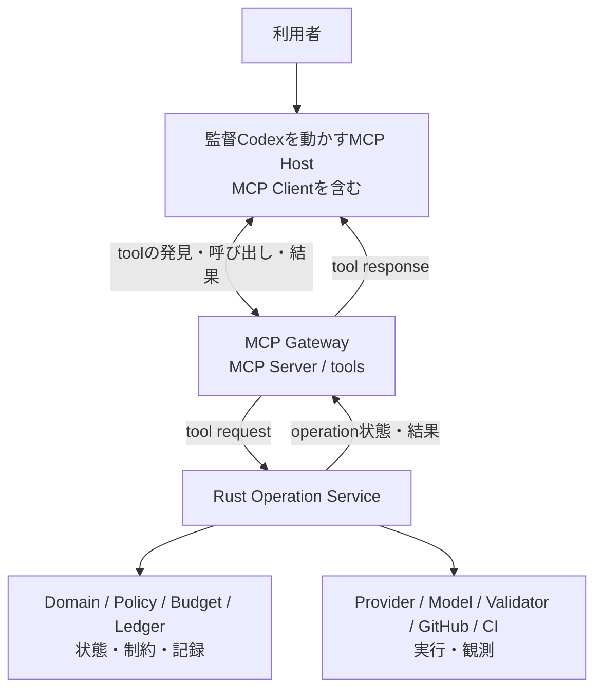

# 監督Codex向け MCP 操作契約

## MCPとは何か

MCP（Model Context Protocol）は、AIアプリケーションが外部サービスの情報や操作を利用するための通信規約である。MCP Host（AIアプリケーション）がClientを通じてMCP Serverへ接続し、Serverが公開するtoolを発見・呼び出して結果を受け取る。この文書が扱うのは、そのうちtoolによる操作の接続である。[MCP仕様](https://modelcontextprotocol.io/specification/2026-07-28)は接続とtool呼び出しの共通形式を定めるが、AI Dev Orchestrator固有のTask、Attempt、Artifactや完了条件は定めない。Host・Client・Serverの関係は[MCPアーキテクチャ](https://modelcontextprotocol.io/specification/2026-07-28/architecture)を参照。

このプロジェクトでMCPを使う目的は、監督CodexがRustの操作を、特定のCLIや会話文の解釈に頼らず、名前・入力・結果が定義されたtoolとして依頼できるようにすることにある。MCP対応Hostと接続する共通のtool interfaceになるが、各Hostがこの契約のtool schemaや必要機能を扱えることは別途確認が必要である。MCP自体がProviderを選んだり、retryしたり、成果物を採用したりするわけではない。また、MCPだけで権限や実行安全性が保証されるわけでもない。Hostはtool利用に対する利用者の同意を扱い、Rust Operation Serviceは操作の検証・実行・記録と、権限・予算・workspace等の制約強制を担当する。MCP Gatewayはtool呼び出しをServiceへ渡す。

## 想定する接続

図は目標構成であり、MCP Gateway / transportはまだ実装対象外である（#45）。このPRが定義するのは、Gatewayが公開するtoolの意味と、Rust Operation Serviceとの境界である。現行CLIの挙動を示す図ではない。

## この契約の役割

監督CodexがRust Operation Serviceに依頼できる操作と、その結果として返る事実を示す。MCPの一般仕様ではなく、AI Dev Orchestrator固有のtool契約である。詳細なwire schema、再送・ページング・取消・エラー等の規則は[実装者向け詳細仕様](mcp-operation-contract-reference.md)を参照する。

## 監督CodexとServiceの分担

監督Codexは依頼の解釈、Provider / Model の選択、再実行やreviewの要否、Artifactの採否、Task完了を判断する。Rust Operation Serviceは依頼を検査し、明示された操作を実行・記録し、revision・権限・予算・workspace等の機械的制約を強制する。MCP Gatewayはtool requestをServiceへ渡し、Serviceの結果をMCP tool responseとして返す。

Serviceは次のProvider / Model、retry、review、成果物の採否、Task完了を自分で選ばない。Providerの終了状態、Validation結果、review verdict、CI状態は別々の観測事実であり、ひとつが成功しても他の成功やTask完了を意味しない。Attempt / Artifact / Validation / ReviewVerdict / CodexDecision等の意味は[ドメインモデル](domain-model.md)を参照する。

## 操作の流れ

1. Taskを作成するか、既存Taskのcontextを読む。
2. 必要な操作を明示して依頼する。長時間処理はoperation IDを受け取り、後で状態や結果を読む。
3. 返された記録を判断し、必要なら次の操作を依頼する。Serviceは判断を代行しない。
4. Artifactを受け入れる場合は判断を記録し、必要な証拠を照合して公開・CI確認・Task完了を依頼する。

## 依頼できる操作

| Tool | 何をするか | 渡すもの | 返るものと読み方 |
| --- | --- | --- | --- |
| `task.create` | Issueまたは手入力の要求を、以後の作業と記録の単位となるTaskとして登録する | Issue snapshot、または手入力の要求と制約 | Task ID と初期revision。以後の操作対象を識別する |
| `task.get_context` | 次の判断に必要なTask情報や作業履歴を、指定した分類ごとに読み出す | Task ID と読みたい情報の分類 | Taskの要求・revisionと、Provider、usage、Attempt、Artifact、Validation、review、decision、PR / CI等の記録。現在までに記録された事実であり、次の手順の自動提案ではない |
| `attempt.run` | 指定されたProvider / Modelに、一回分の作業を依頼してAttemptとして記録する | Task、Provider / Model、instruction、role、入力Artifactまたは初期base | 受付時にoperation IDとAttempt ID。完了後にProvider実行の状態、出力Artifact、usage等。受付は実行成功を意味しない |
| `operation.get` | 長時間処理のoperationが進行中か、どの結果で終了したかを確認する | operation ID | operationの進行状態・最終結果。`completed`等の終端状態と結果を確認してから処理結果を判断する |
| `operation.list_logs` | operationが出したログの一部を、streamと範囲を指定して読む | operation ID、stream、必要ならcursorと件数上限 | 指定範囲のredacted logと続きのcursor。ログ末尾を読んだだけではoperationの終了を意味しない |
| `operation.cancel` | 一つのoperationに停止を要求する | 対象operationとTask、最新revision | 取消要求を表すoperationの受付。対象operationの停止を確認するまでは取消完了ではない |
| `task.cancel` | Task全体を停止し、未終了operationにも取消を要求する | Task、最新revision、任意の取消理由 | 停止要求の受付。関連operationとTaskの状態を確認するまでは取消完了ではない |
| `validation.run` | Artifactに対して指定された機械検査を実行する | 対象Artifactと検査profileまたは検査内容 | 受付後、対象Artifactに対する各検査の結果。Validation成功はArtifactの採用判断ではない |
| `decision.record` | Artifactを採用するかどうかの監督Codexの判断と理由をTaskの記録に残す | 対象Artifact、判断、理由、参照証拠 | 保存されたCodexDecisionと更新後revision。reviewerの判断とは別の記録 |
| `publication.publish` | 採用済みArtifactを指定先へ公開し、Pull Requestを作成する | 対象Artifact、accepted decision、公開先・PR情報 | 受付後、公開結果とPR / head SHAの参照。PR作成だけでCI成功やTask完了にはならない |
| `ci.get` | PRまたはcommitのCI check状態を一度だけ観測する | Publication、PRまたはcommit | 対象SHAについて観測したcheck状態。`unknown` / `pending` は成功ではない |
| `ci.wait` | PRまたはcommitのCI状態を期限まで待ち、確定したcheck状態を観測する | Publication、PRまたはcommit、期限 | 受付後、対象SHAの観測結果。期限内に確定しない場合も成功とは扱わず、operationの結果を確認する |
| `task.finish` | Artifactと採用判断・必要な証拠を照合し、Taskの完了を確定する | 完了させるArtifact、accepted decision、必要な証拠 | 条件を満たせばcompleted Task。Serviceは証拠を照合し、不足や不一致があれば完了を拒否する |

## 結果を読むときの要点

- 非同期toolの受付応答は「依頼を受け付けた」という意味であり、処理結果は `operation.get` で確認する。
- Provider実行成功、Validation成功、review承認、監督Codexの採用判断、CI成功、Task完了は互いに置き換えられない。
- 証拠は保存済みの記録への参照である。別Artifactや別PR / SHAの結果を対象の根拠として使わない。
- `unknown`、未観測、timeout、中断は成功やゼロとして扱わず、状態を読み直して次の操作を判断する。
- Serviceが返す観測事実をCodexが書き換えたり、Serviceが未依頼の判断・次工程を自動実行したりしない。

toolごとの必須fieldと型、共通response、cursorの継続条件、requestの冪等性、revision競合、error code、secretとlogの扱いは[実装者向け詳細仕様](mcp-operation-contract-reference.md)を参照する。
