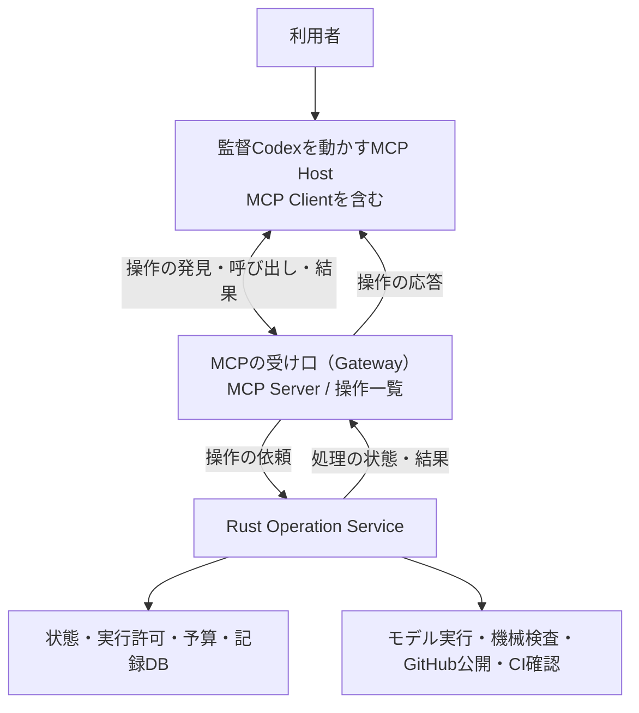

# 監督Codex向け MCP 操作契約

## 読者と前提

[開発支援システムの全体像](architecture.md)を読んだ人が、監督Codexから依頼できる操作を確認するための文書である。内部APIやJSONの型を知らなくても、下の作業例と操作一覧で「何を渡し、何を結果と読めばよいか」を確認できる。正確な項目名と型は[操作の詳細仕様](mcp-operation-contract-reference.md)に分ける。

## 一件の修正を依頼する例

たとえば利用者が「Issueにある不具合を直してPRにして」と依頼した場合、監督Codexは作業を登録し、担当モデルへ修正を依頼する。Rust側が変更内容を保存した後、監督Codexがテストを依頼して結果を読み、採用判断を記録してPR公開を依頼する。CI結果も確認し、必要な条件が揃った場合に作業完了を依頼する。

```text
作業の登録 → モデル実行の依頼 → 保存済み成果物の検証
                                   ↓
作業完了の依頼 ← 公開・CIの確認 ← 監督Codexの採用判断
```

途中の検証で問題があれば、監督Codexが保存済み成果物を入力にして修正を再依頼する。AIレビューは必要と判断した場合に依頼する。この例は目標とする操作の使い方であり、全操作の統合実装が完成しているという説明ではない。

## MCPとは何か

MCP（Model Context Protocol）は、AIアプリケーションが外部サービスの情報や操作を利用するための通信規約である。MCP Host（AIアプリケーション）がClientを通じてMCP Serverへ接続し、Serverが公開する操作を発見・呼び出して結果を受け取る。この文書が扱うのは、そのうち、名前と入力が定義された操作（tool）を呼び出す接続である。[MCP仕様](https://modelcontextprotocol.io/specification/2026-07-28)は接続と操作呼び出しの共通形式を定めるが、AI Dev Orchestrator固有のTask、Attempt、Artifactや完了条件は定めない。Host・Client・Serverの関係は[MCPアーキテクチャ](https://modelcontextprotocol.io/specification/2026-07-28/architecture)を参照。

このプロジェクトでMCPを使う目的は、監督CodexがRustの操作を、特定のCLIや会話文の解釈に頼らず、名前・入力・結果が定義された操作として依頼できるようにすることにある。MCPに対応するAIアプリケーションと接続する共通の操作の入口になるが、各Hostがこの契約の操作の入力形式や必要機能を扱えることは別途確認が必要である。MCP自体がProviderを選んだり、再試行したり、成果物を採用したりするわけではない。また、MCPだけで権限や実行安全性が保証されるわけでもない。Hostは操作利用に対する利用者の同意を扱い、Rust Operation Serviceは操作の検証・実行・記録と、権限・予算・作業場所等の制約強制を担当する。MCPの受け口（Gateway）は操作呼び出しをServiceへ渡す。

## 想定する接続


```mermaid
flowchart TB
    User[利用者] --> Host[監督Codexを動かすMCP Host<br/>MCP Clientを含む]
    Host <-->|操作の発見・呼び出し・結果| Gateway[MCPの受け口（Gateway）<br/>MCP Server / 操作一覧]
    Gateway -->|操作の依頼| Service[Rust Operation Service]
    Service -->|処理の状態・結果| Gateway
    Gateway -->|操作の応答| Host

    Service --> Store[状態・実行許可・予算・記録DB]
    Service --> Workers[モデル実行・機械検査・GitHub公開・CI確認]
```

図は目標構成であり、MCPの受け口と通信処理の実装は#45が担当する。この操作仕様が定義するのは、受け口が公開する操作の意味と、Rustの共通操作処理との境界である。現行CLIの挙動を示す図ではない。

## この契約の役割

監督CodexがRust Operation Serviceに依頼できる操作と、その結果として返る事実を示す。MCPの一般仕様ではなく、AI Dev Orchestrator固有の操作契約である。詳細な通信上の入力・出力形式、再送・ページング・取消・エラー等の規則は[実装者向け詳細仕様](mcp-operation-contract-reference.md)を参照する。

## 監督CodexとServiceの分担

監督Codexは依頼の解釈、Provider / Model の選択、再実行やレビューの要否、Artifactの採否、Task完了を判断する。Rust Operation Serviceは依頼を検査し、明示された操作を実行・記録し、更新番号・権限・予算・作業場所等の機械的制約を強制する。MCPの受け口（Gateway）は操作の依頼をServiceへ渡し、Serviceの結果をMCPの操作応答として返す。

Serviceは次のProvider / Model、再試行、レビュー、成果物の採否、Task完了を自分で選ばない。Providerの終了状態、Validation結果、レビュー結果、CI状態は別々の観測事実であり、ひとつが成功しても他の成功やTask完了を意味しない。Attempt / Artifact / Validation / ReviewVerdict / CodexDecision等の意味は[ドメインモデル](domain-model.md)を参照する。

## 操作の流れ

1. Taskを作成するか、既存Taskの要求と履歴を読む。
2. 必要な操作を明示して依頼する。長時間処理は受付済み処理の識別子（operation ID）を受け取り、後で状態や結果を読む。
3. 返された記録を判断し、必要なら次の操作を依頼する。Serviceは判断を代行しない。
4. Artifactを受け入れる場合は判断を記録し、必要な証拠を照合して公開・CI確認・Task完了を依頼する。

## 依頼できる操作

| 操作名 | 何をするか | 監督Codexが渡すもの | 返るものと読み方 |
| --- | --- | --- | --- |
| `task.create` | 要求を一つの作業として登録する | 取得時点のIssue情報、または手入力の要求と制約 | 作業IDと初期更新番号。以後の操作対象を識別する |
| `task.get_context` | 次の判断に必要な要求や履歴を読む | 作業IDと読みたい情報の分類 | 要求・更新番号・候補・使用量・実行・成果物・検証・レビュー・判断・PR・CIの記録。次の操作の自動提案ではない |
| `attempt.run` | 指定した実行先・モデルへ一回仕事を依頼する | 作業、実行先・モデル、指示、担当、保存済み成果物または開始時点のコード | 受付時には処理IDとモデル実行ID。完了後に実行状態・出力成果物・使用量など。受付だけでは成功を意味しない |
| `operation.get` | 長時間処理の状態と結果を読む | 処理ID | 進行状態と最終結果。終了状態を確認してから結果を判断する |
| `operation.list_logs` | 処理のログの一部を読む | 処理ID、出力の種類、範囲、必要なら続きの取得位置と件数上限 | 秘密情報を伏せ字化したログと、続きの取得位置。末尾を読んだことは処理完了を意味しない |
| `operation.cancel` | 一つの処理に停止を要求する | 対象処理、作業、最新更新番号 | 取消要求の受付。対象の停止を確認するまで取消完了ではない |
| `task.cancel` | 作業全体と未終了の処理に停止を要求する | 作業、最新更新番号、任意の取消理由 | 停止要求の受付。関連処理と作業の状態を確認するまで取消完了ではない |
| `validation.run` | 保存済み成果物に機械検査を行う | 対象成果物と、登録した検査セットの識別名または検査内容 | 受付後、対象成果物に対する検査結果。検証成功は成果物の採用判断ではない |
| `decision.record` | 成果物への監督Codexの採否判断を保存する | 対象成果物、判断、理由、参照する記録 | 保存された判断と更新番号。レビュー担当の判断とは別の記録 |
| `publication.publish` | 採用済み成果物を公開してPRを作る | 対象成果物、保存済みの採用判断、公開先、PR情報 | 受付後、公開結果とPR・公開コミットの参照。PR作成だけでCI成功や作業完了にはならない |
| `ci.get` | PRやコミットのCIを一度確認する | 公開記録、PRまたはコミット | 対象コミットについて観測した検査状態。不明や未終了は成功ではない |
| `ci.wait` | PRやコミットのCIを期限まで待つ | 公開記録、PRまたはコミット、期限 | 受付後、対象コミットの観測結果。期限内に確定しなくても成功とは扱わない |
| `task.finish` | 成果物と判断・必要な記録を照合し、作業完了を確定する | 対象成果物、保存済みの採用判断、必要な記録 | 条件を満たせば完了したTask。不足や不一致があれば完了を拒否する |

## 結果を読むときの要点

- 非同期操作の受付応答は「依頼を受け付けた」という意味であり、処理結果は `operation.get` で確認する。
- Provider実行成功、Validation成功、レビュー承認、監督Codexの採用判断、CI成功、Task完了は互いに置き換えられない。
- 証拠は保存済みの記録への参照である。別Artifactや別PR / SHAの結果を対象の根拠として使わない。
- `unknown`（不明）、未観測、時間切れ、中断は成功やゼロとして扱わず、状態を読み直して次の操作を判断する。
- Serviceが返す観測事実をCodexが書き換えたり、Serviceが未依頼の判断・次工程を自動実行したりしない。

操作ごとの必須項目と型、共通応答、履歴を分けて読む条件、同じ依頼の再送、更新番号の競合、エラーコード、秘密情報とログの扱いは[実装者向け詳細仕様](mcp-operation-contract-reference.md)を参照する。
